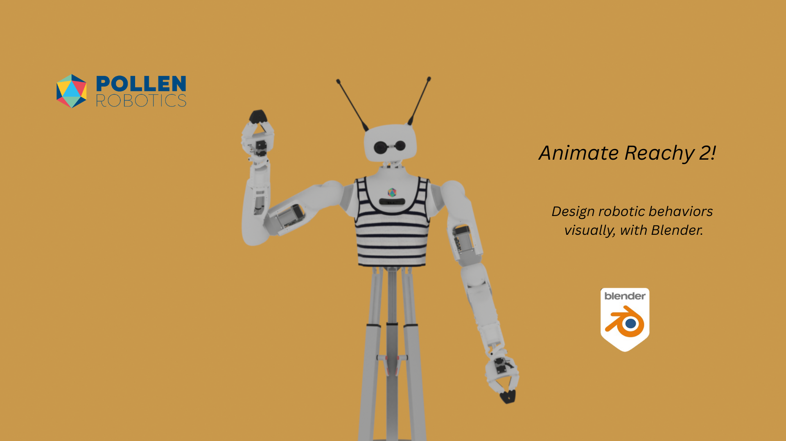
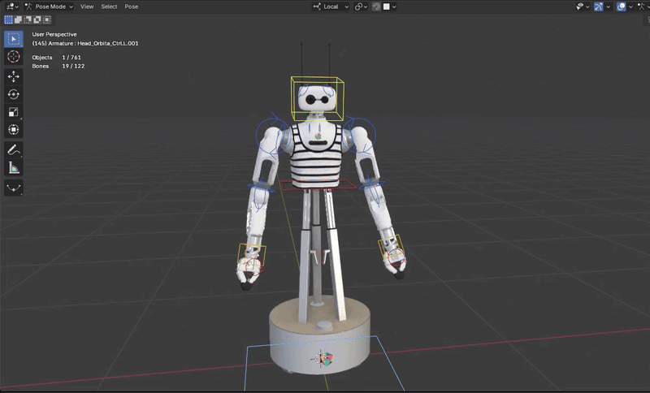
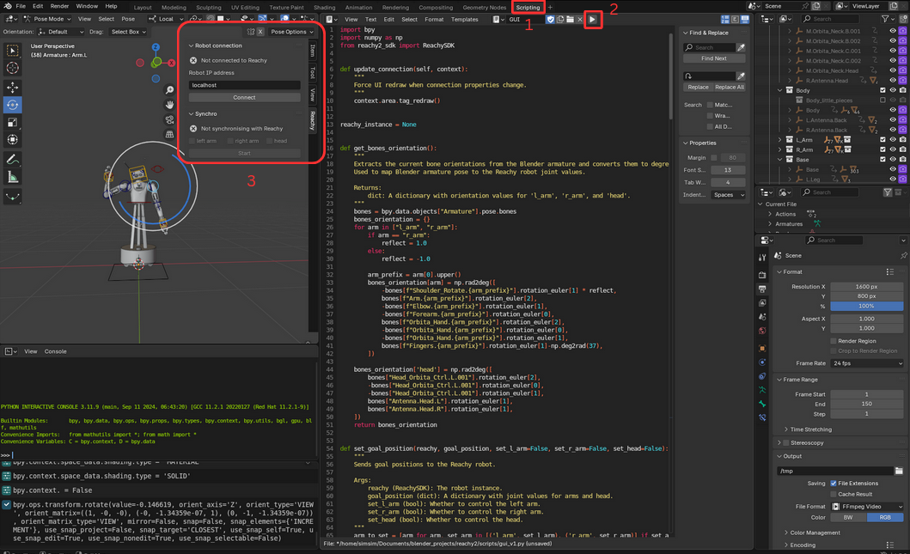
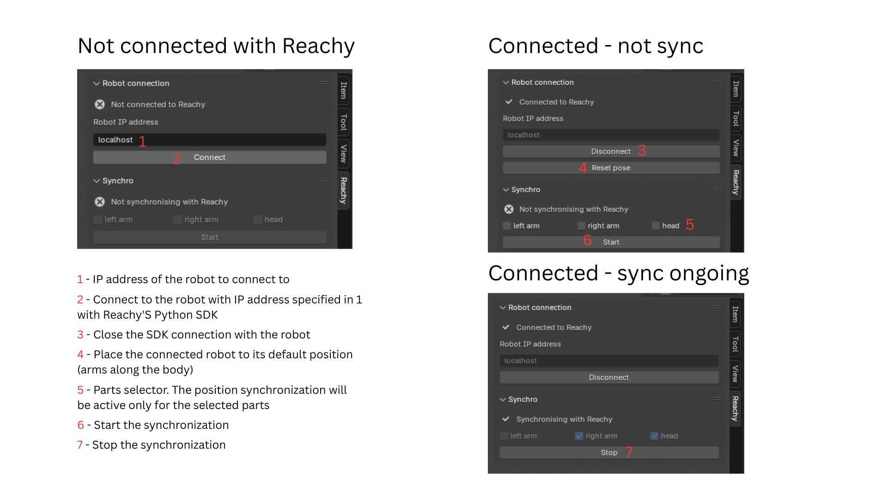
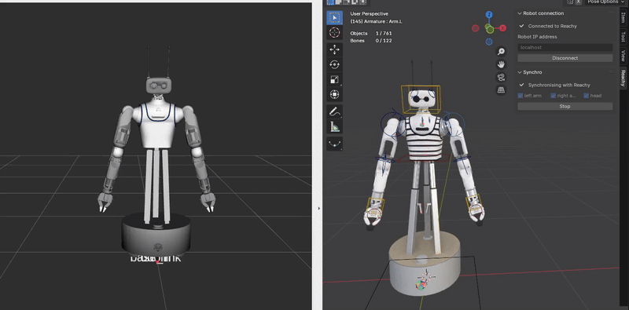

# Blender Reachy Animation


<div align="center">



</div>

This project demonstrates the integration of the open-source humanoid **Reachy** in **Blender**.

The goal of this project is double: 
- offer the robot's 3D asset to the community of creatives made of artists, game designer, video makers or whoever wants to have fun with a virtual robot and produce nice animations with it,
- facilitate the development of bahaviors on Reachy with a no code approach which can then be exported to the robot.

This repo contains the Blender file with the **rigged model of Reachy**, along with a script to **synchronize Blender animations with real-time robot movements** using Reachy's Python SDK.


## Requirements
To use the rigged model:
- **Blender**: The project is compatible with Blender **4.3.2** and above. You can download it from the [official website](https://www.blender.org/download/). Once installed, you can open the `reachy2.blend` file and start animating the rigged model.

If you want to synchronize the animations with a simulated robot:
- You will need a fake Reachy simulation running. A **Docker** is available with Reachy's stack [here](https://hub.docker.com/r/pollenrobotics/reachy2).

## Installation
### Blender Installation
Download the latest version of Blender from the [official website](https://www.blender.org/download/).

<details>
<summary>Adding the sailor shirt to the texture</summary>

If you open the Blender project `reachy2.blend` as is and switch in the viewport shading to *Material Preview* or *Rendered* mode, you will see that the robot shirt which is supposed to be a sailor shirt is missing its texture. This is a texture needs to be added manually.

To add it, follow these steps: 
1. Go to shading workspace in the top bar
2. Switch to object mode
3. In the shader editor, select Object instead of World
4. In the node 'mariniere.jpg', click on Open Image and select the mariniere.jpg file in the assets folder. The texture should now be visible in the viewport.

The video below shows the steps to follow to add the texture to the shirt.

<div align="center">


</div>

</details>

### SDK Installation
To be able to run the synchronization script, you need to install the Reachy SDK in Blender's Python environment. To do so, follow these steps:
1. Open a terminal and navigate to the folder where you installed Blender.
2. Once in the folder, you will need to go to the Python binary folder of Blender. The path will look like this:
   ```bash
   cd <blender_version>/python/bin
   ```
   For example if you installed the 4.4.1 version of Blender, the command will be:
    ```bash
    cd blender-4.4.1-linux-x64/4.4/python/bin
    ``` 
3. Once in the Python binary folder, you can install the Reachy SDK using pip. Run the following command:
    ```bash
    ./python3.11 -m pip install reachy2-sdk>=1.0.10
    ```
    Please note the minimal sdk version required is 1.0.10 to be able to fully us ethe syncrhonization script.

## Usage
### Animating the rigged model
Every joint of the robot can be controlled independently.

For the subparts actuated by an Orbita2D (shoulder, elbow of each arm), two circular controllers are available, one per degree of freedom. </br> The wrists and neck of the robot are controlled by Orbita3D actuators with 3 degrees of freedom and can be rotated along each axis by selecting the corresponding yellow box.

<div align="center">



</div>

### Synchronizing with Reachy
If you want to synchronize the Blender model with a real or simulated Reachy, you need to run the `GUI.py` script in Blender. This script will open a custom window allowing you to connect to a robot and handle the synchronization. The window will be available in any Blender workspace.

The two steps to run the script are:
1. Go to the **Scripting** workspace in Blender.
2. The GUI script should be opened in the text editor. Select it and click on **Run Script**.

Once the script is running, the window (3) should appear.
<div align="center">



</div>

When using the Reachy control window, you will face three different window state detailed below:

<div align="center">



</div>

When the syncrhonization is ongoing, the state of the selected parts (head, right arm and/or left arm) will be copied to the robot. The synchronization is done in real-time, so you can move the robot in Blender and see it moving on the robot.

<div align="center">



</div>